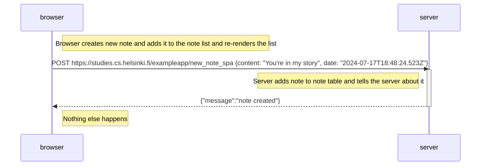

```mermaid
sequenceDiagram
    participant browser
    participant server
    
    Note right of browser: Browser creates new note and adds it to the note list and re-renders the list
    browser->>server: POST https://studies.cs.helsinki.fi/exampleapp/new_note_spa {content: "You're in my story", date: "2024-07-17T18:48:24.523Z"}
    activate server
    Note left of server: Server adds note to note table and tells the server about it
    server-->>browser: {"message":"note created"}
    deactivate server
    Note right of browser: Nothing else happens
```